# PennyWise

# Team code_squad

### ISEE 2020 Basic Prototype 

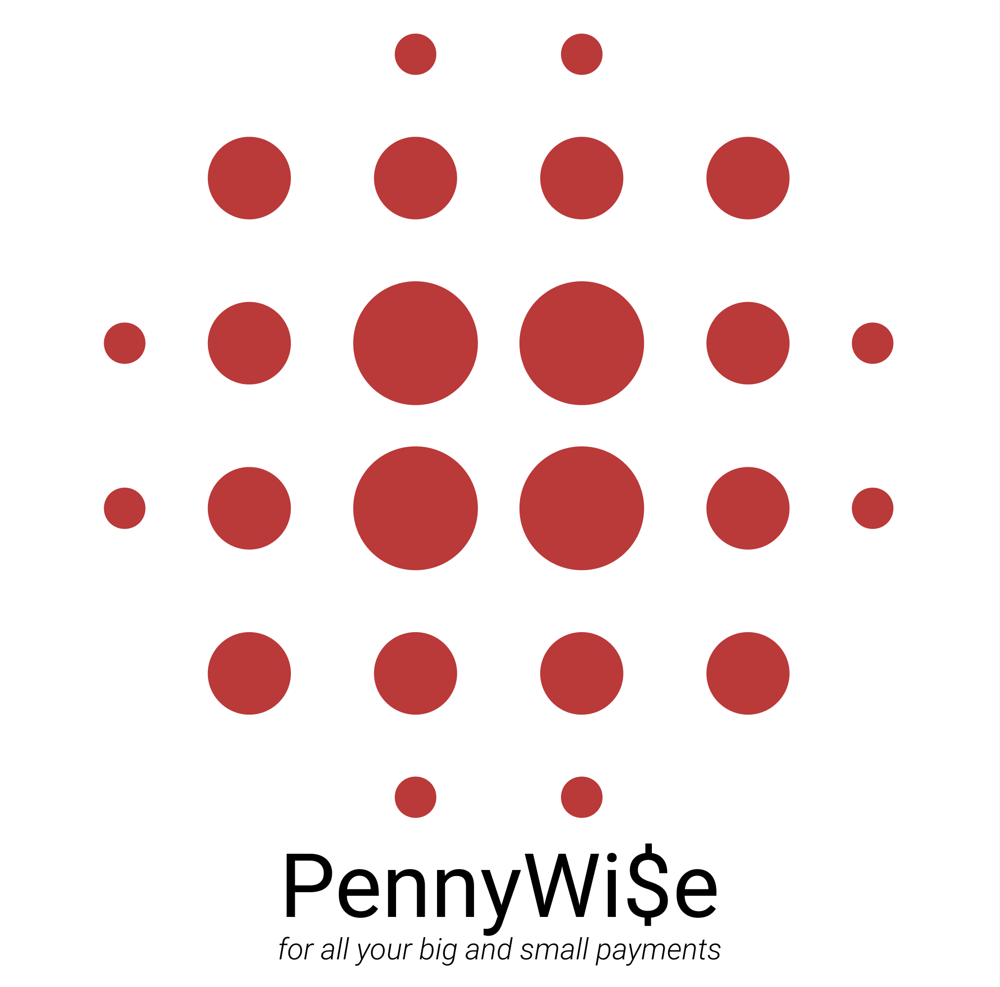

## Overview

After our successful implementation of the Basic Prototype, we have moved on to the next phase in our application development. In this phase, we have received further requirements from the Product Owner. The given set of requirements are a must have and also this includes some alterations to be done over the previously implemented prototype. We have adapted ourselves to these dynamic requirements and modified the code accordingly.

## Software Architecture

A good software architecture while building any product is important, otherwise it becomes slower and more expensive to add new capabilities in the future. Software Architecture illustrates design decisions that need to be made early in a project. Software Architecture serves as the blueprint for both the system and the project developing it, defining the work assignments that must be carried out by design and implementation team. The architecture is the primary carrier of system qualities such as performance, modifiability, and security, none of which can be achieved without a unifying architectural vision.

Patterns were majorly classified into 3 broad categories.

- Creational Pattern
- Behavioral Pattern
- Structural Pattern

These patterns provide a solution for solving recurring issues related to common software development problems. We have decided to use two design patterns throughout our development. They are the Composite Design Pattern and Model-View- Controller.

- ### Model View Controller

  1. **Models**

     Models represent knowledge. A model could be a single object or it could be some structure of objects. There should be a one-to-one correspondence between the model and its parts on the one hand, and the represented world as perceived by the owner of the model on the other hand.

  2. **Views**

     A view is a visual representation of its model. It would ordinarily highlight certain attributes of the model and suppress others. It is thus acting as a ***presentation filter***.

     A view is attached to its model and gets the data necessary for the presentation from the model by asking questions. 

  3. **Controllers**

     A controller is the link between a user and the system. It provides the user with input by arranging for relevant views to present themselves in appropriate places on the screen. 

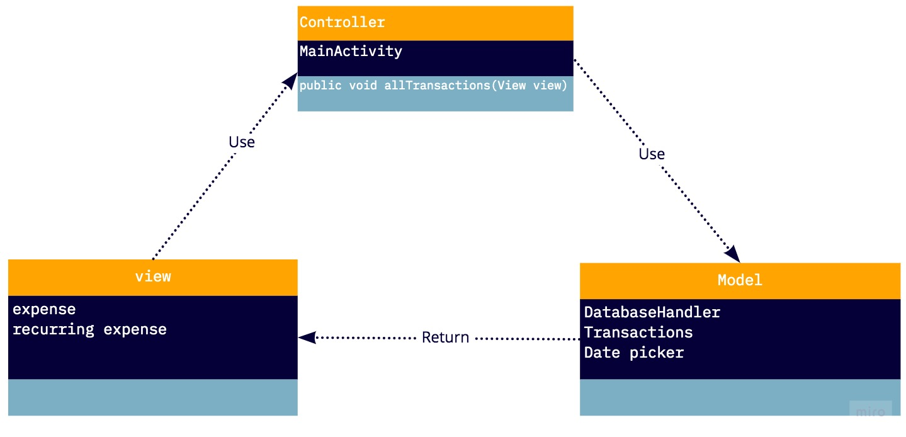

### But why MVC?

Model View Controller is one of most popular design patterns. The application involves an end user interacting through input actions such as clicks, selection, etc. to process the backend data and to keep track of money control. Purpose of the application is more aligned with the MVC pattern where the model forms the backend data, controller forms the user actions and view forms the visual representations For eg, on click of submit button (controller) in transaction page the data entered by the user in various fields (view) the data gets saved to the database table **Transactions** (model).

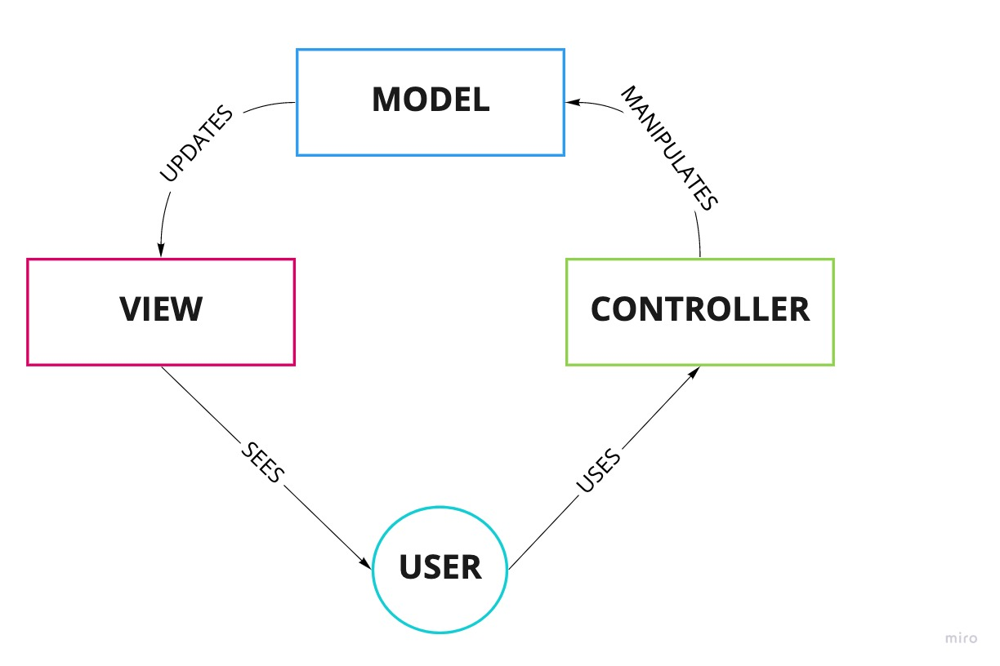

## 3 Tier Architecture

With this 3-tier architecture, we have the ability to utilize new technologies as they become available. This ensures our product is ready to adapt; ready for the future. We have the opportunity to redesign the product or application and actually look not only to today’s needs but into the future. Benefits for this:

* It gives you the ability to update the technology stack of one tier, without impacting other areas of the application.

* It allows for different development teams to each work on their own areas of expertise.
* You are able to scale the application up and out.
* It adds reliability and more independence of the underlying servers or services.

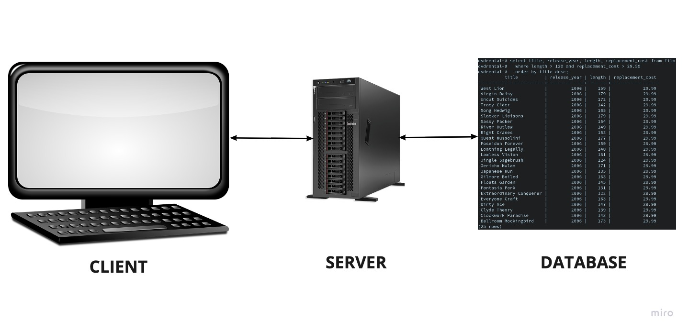

## Coding Conventions

There are some guidelines and prototypes which software developers need to follow for the coding standard procedure. Writing good quality code is an important task while developing any software. It’s an essential investment for your project rather than a time-consuming task. It’s an essential way to lower technical debt. When the code is neat and clean, it’s easy to understand, maintain and extend. Any good quality code which is readable and consistent is easier to review, which in turn leads to a low maintenance effort. Some of the conventions we followed are:

- **CamelCaseNotation** -This convention is used in naming functions, variables, and class names.

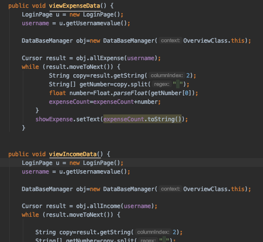

- **lower_case Notation** - This convention is used in all the imports, and naming XML pages.

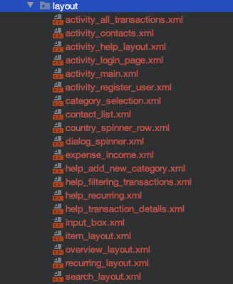

- **Own conventions** - we used “_” in naming XML pages and Android.id of the XML pages.This convention is utilised when the element name is longer

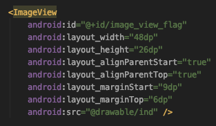

## How did we enforce these conventions?

The defined conventions were documented and a detailed report containing usage of the conventions was circulated and explained in detail among team members. This made sure that the whole project had a unified naming convention. Additionally, the conventions were ensured by proof-reading, while performing stash and commit operations.

## Context of use

Collecting and analyzing detailed information about the intended users, their tasks, and the technical and environmental constraints is certainly of primary importance. The data for a context of use analysis can be gathered using interviews, workshops, surveys, site visits, focus groups, observational studies, an so on.

The main goals are:

- Ensure that all factors that relate to use of the system are identified before design work starts.
- Provide a basis for designing later usability tests

We gathered such data of two people with a very different wants and needs, as to why they need our PennyWise application.

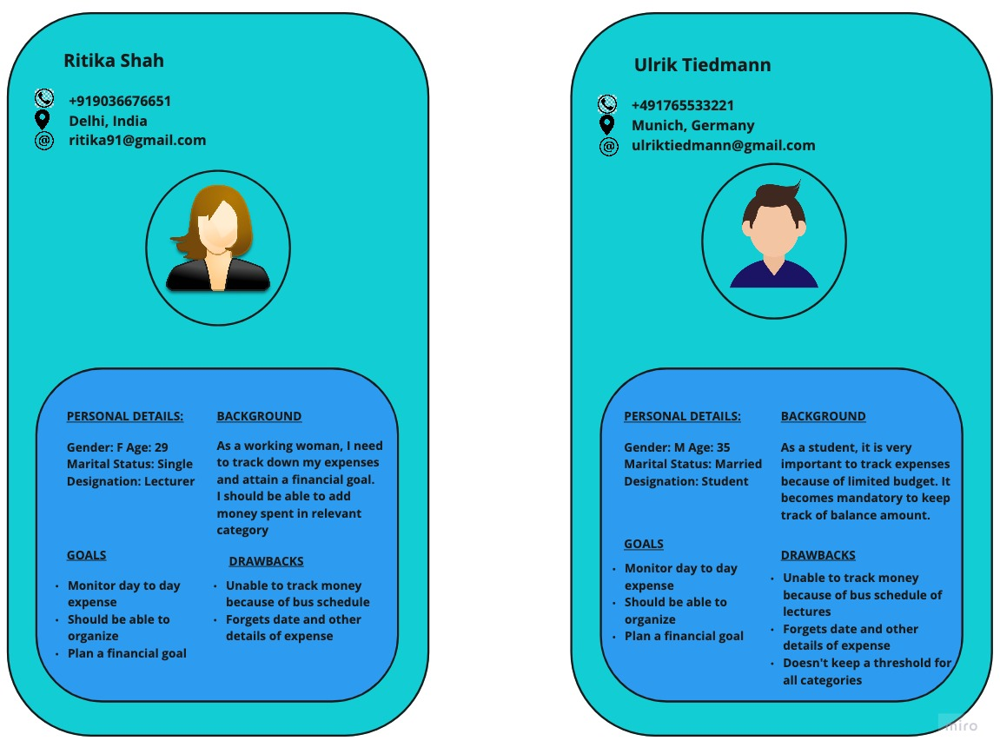

### Design Solution

Our design solution is to provide the user with all the essential and required functionalities with simple and basic user interface

**Navigational capabilities and UI:** The basic user interface makes user life easy to easily navigate across screens. The back button is provided in all the screens, which allows the user to navigate to the previous form without any hassles

**Security:** - The user security is provided with an option to enable or disable pin. So, whenever the app is opened, the pin verification is done

**Error Handling:** - The error messages are displayed to highlight the user with the errors. The mandatory fields are highlighted, to let the user know about the required details which needs to be entered

**Acknowledgement:** - The acknowledgement messages are displayed to let the user know that, the details entered are saved or modified or deleted

The below diagram depicts User Story (adding a new transaction) from the given set of requirements. The sequence of screen shows where the user navigates from home page for adding transaction. Once he / she clicks add transaction he will get a list of categories to pick from and then also custom category to add his own category. He / She will then be asked to provide more details and upon clicking submit button, he / she will have successfully created a new expense.

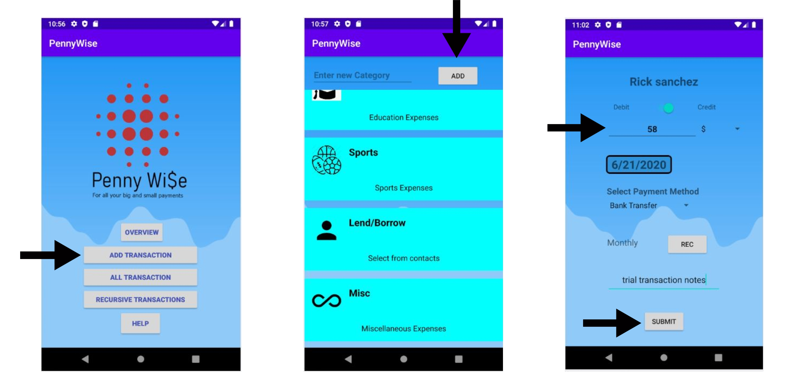

Once the user enters the home screen after logging in, to add a new transaction the user clicks on 'add transaction' button which takes the user to a list view of categories. Lend/Borrow is one of such categories, when the user clicks on it, will be shown a list of existing contacts in the device. User can select one of the contact to enter the next activity to add rest of the transaction details. User mentions the debit/credit type, currency, date etc and hits submit adding the details to the Database. A successful transaction takes the user back to homepage.

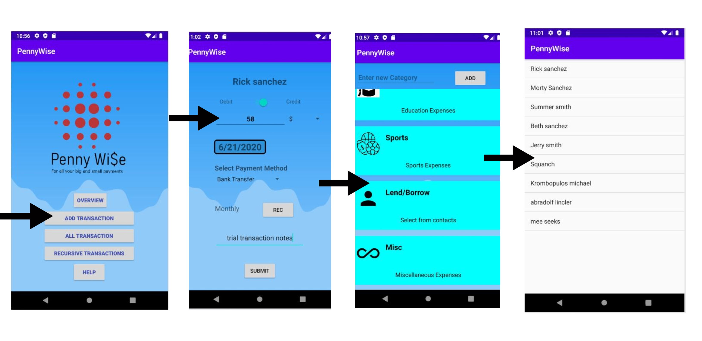

## Summary of Changes

The following are the changes that are added or modified as part of our advanced prototype.

- **Application User Interface**: The look and feel of the application have been changed, with few alignments modified for all the fields throughout the application.

- **Authentication/Log in**: Our basic prototype had the user to set the pin mandatory and every time the user logs in. But, now in the Advanced Prototype, the user is given the option to enable or disable pin in the Pin Settings.

- **Currency Drop-down**: A new button has been incorporated in the Home Screen to set a threshold value for individual categories.

- **Push Notifications**: When the user enters an amount for a particular category and the maximum budget for that category has been set, the user will receive a pushdown notification for every transaction that occurs to that category.

- **Numeric keypad**: A user will get an option of keypad only in numeric while he / she is filling numeric field details.

  
### User Stories in Basic Prototype

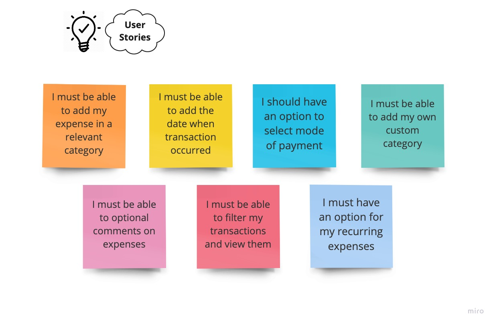

### User Stories in Advanced Prototype

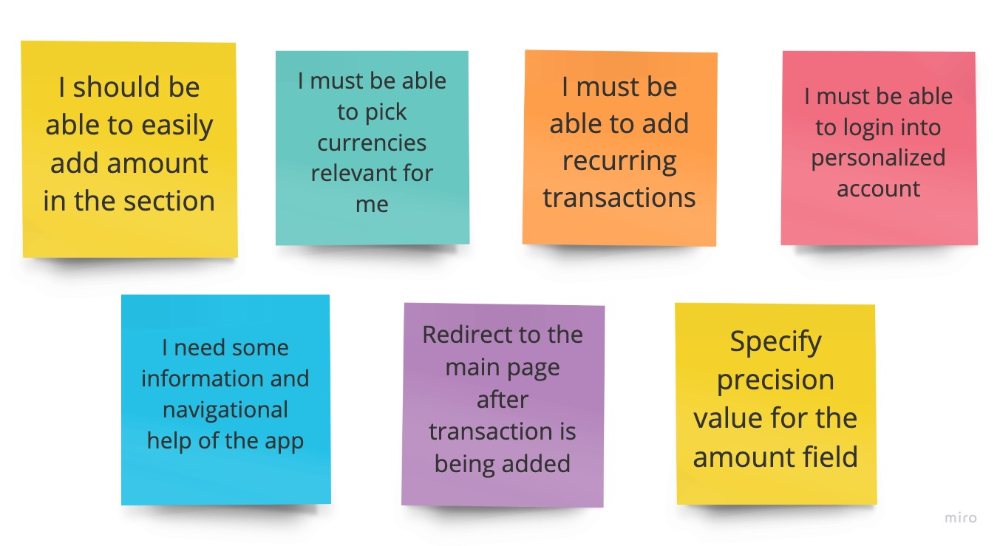

### Updated Class Diagram

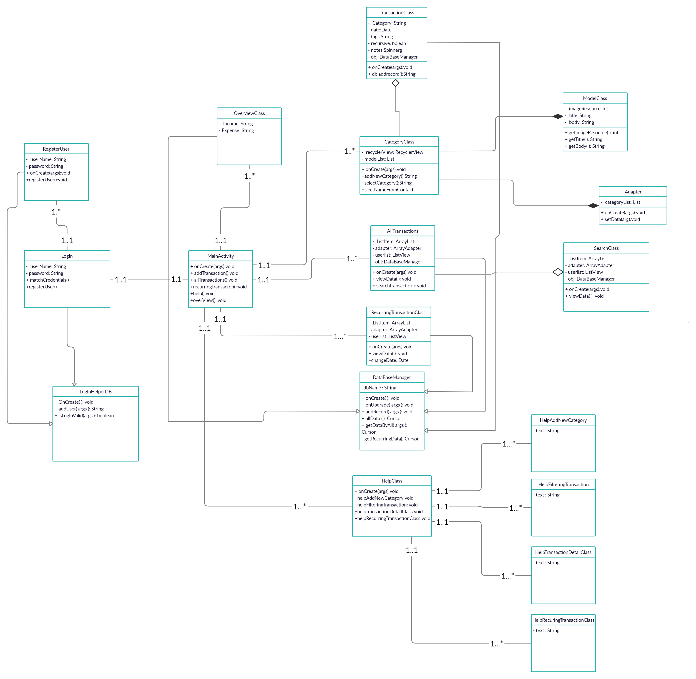

### Download apk 

Please click on the below link to download our basic version of PennyWise:

[PennyWise.apk](uploads/0dabcd4294f7f952101c69dd204ae486/PennyWise.apk)

### Application Screenshots

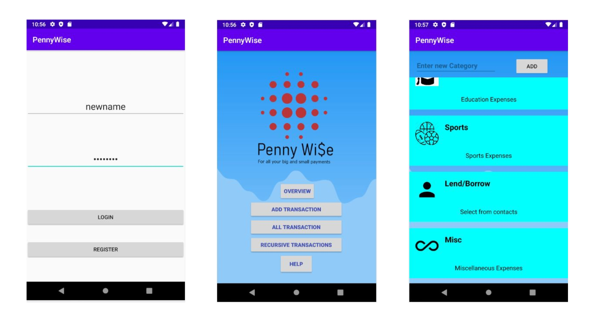

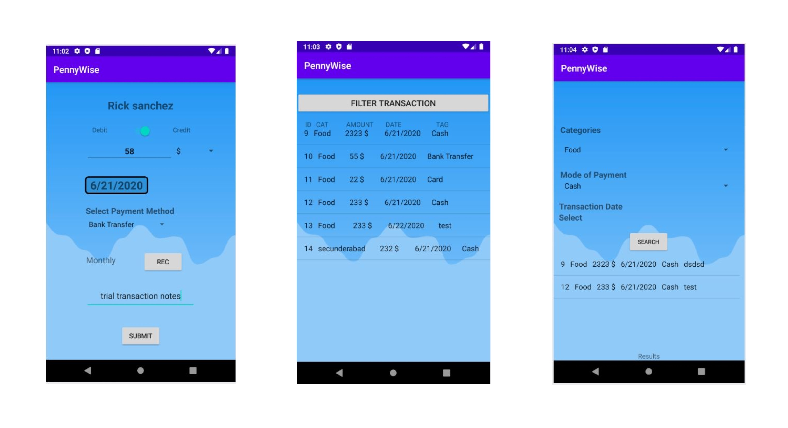

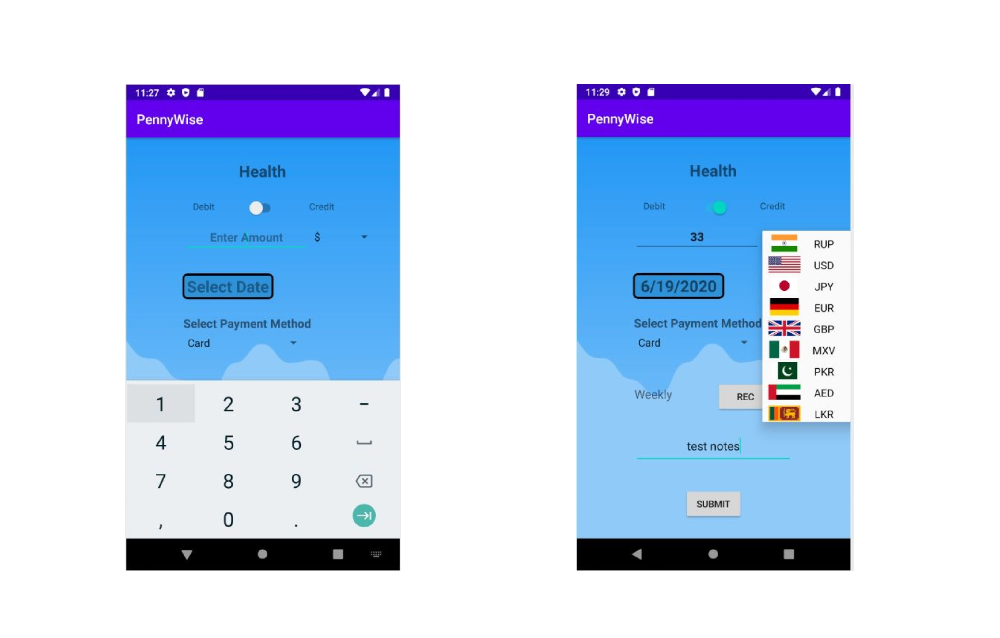

## *Thanks for visiting our Blog!*

