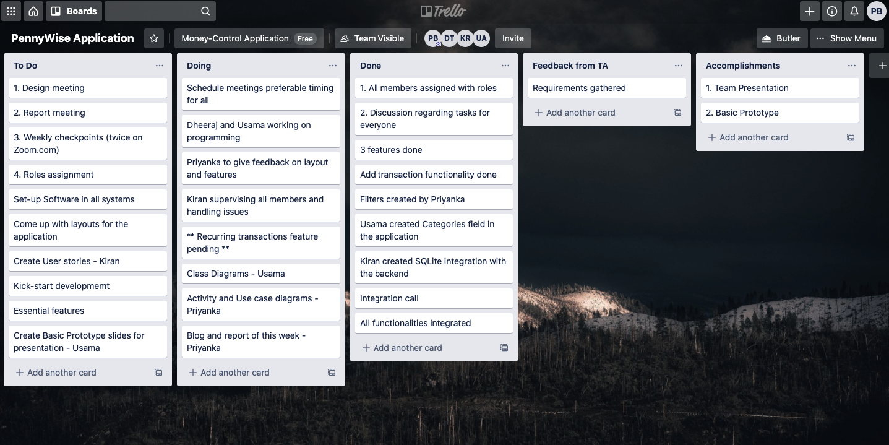

# PennyWise 

# Team code_squad

## Overview

We have successfully implemented the first milestone, that is the basic prototype version of our android application **PennyWise**. This phase has demonstrated our team effort and coordination right from gathering requirements and analysing them to delivering our first application prototype.

## Essential Requirements

* Every transaction must be recorded and also categorized under specific areas to track exactly where the money had been spent.

* The category field has to be a dropdown consisting of some generic pre-defined values such as rental expenses, health, travel etc. 

* The user can add custom category if any transaction is not relevant to the pre-defined categories.

* The user should be able to add date of transaction, mode of payment made i.e Card / Cash / Online Banking which is also a dropdown.

* The user must be able to add any notes / comments to the particular transaction that is being entered.

* Enter Income/Expense and Enter Amount fields must have only numeric keypad as input.

* The user must be able to track recurring expenses as few payments are recurring with certain frequency. This field should be a checkbox.

* The user should be able to view all transactions / expenses that he / she added.

* The user should be able to filter transactions based on values of categories, mode of payment, and also date of transaction. 

## Requirement Analysis

Understanding requirements of customers forms basis for any software development product. We categorized all essential requirements in three phases as we progressed:

* **Requirement Input:** We held weekly meetings with the product owner and all stakeholders to understand what needs to be built from their perspective. All the requirements were made note of and various parameters pertaining to the requirements were agreed upon.

* **Requirement Analysis:** Based on the requirements discussion, we analyzed the feasibility from a technical perspective and tried to understand if there were any technical limitations due to which any features could not be implemented.

* **Requirement Documentation:** We kept good track of our progress by maintaining a Trello account, and also by submitting weekly reports.

  

## System Design Implementation

We have designed the following diagrams that help explain our project flow:

* **Use Case Diagram:**

  Use case diagrams are used to represent high-level functionalities and how the user wil be able to handle the system. The purpose of use case diagrams is to capture core functionalities of a system (in our case: application) and visualize the interactions of various things called as actors with the use case. The use case diagrams represent the core parts of a system and the workflow between them. 

  In below diagram, it depicts user upon opening PennyWise application, will have two options: 1) To add a new expense 2) To view an already added expense. If he / she clicks former option i.e to add a transaction, he has to next choose or create a category in which his expense was used. He will then be directed to next page that will enable him to add amount, transaction date, mode of payment, and optionally comments if he / she has to keep a note of something. If he has already populated some expenses, he may click latter option to view them. He can also filter the expenses based on his needs.

* **Activity Diagram:**

  Activity diagrams present a number of benefits to users. Activity diagram demonstrates the logic of an algorithm, it also describes the steps performed in a use case, it illustrates a business process / workflow between users and the product. It even goes on to simplify and improve any process by clarifying complicated use cases.

* **Class Diagram**

  Class diagrams are one of the most useful types of diagrams in UML as they clearly map out the structure of a particular system by modeling its classes, attributes, operations, and relationships between objects.

  Class Diagrams are important because they:

  - Illustrate data models for information systems, no matter how simple or complex.
  - Better understand the general overview of the schematics of an application.

**MainActivity:**

**void onCreateMethod():** Initializes the activity.

**void addTransaction():** Takes the user to the CategoryClass where the user can add Transaction.

**void allTransaction():** Takes the user to the Transaction Class where the user can see all the transactions.

**recurringTransaction():** Takes the user to the RecurringTransactionClass where user can see all the recurring transactions.

**CategoryClass:**

This class will show the list of categories to the user from where the user can select a category for his transaction or add a new category.

**RecyclerView recyclerView:** Recycler view is used to display all the category.

**List modelList:** List is used to display all the category and add a new category.

**void onCreateMethod():** Initializes the activity.

**void addNewCateogory(args):** Takes the input from the UI and add a new category into the recycler view.

**String selectCategory(args):** when user selects Category from the list view by clicking on it, this method moves to the next transaction class activity along with the value of the selected category.

**TransactionClass:**

This Class provides the user opportunity to specify the details of the transactions which will then be stored in the data base.

**String Category**: Displays the selected category from the category class.

**Date date:** Allows user to select date.

**Spinner tag:** Allow user to select a tag for a category.

**Switch recursive:** If the user checks this button the Boolean value for the recursion is made true.

**String notes:** Allow the user to add notes in the form of the string.

**String Db.addrecord(args):** Takes all the data provided from the user in the form of the spring and store it in the database.

**void onCreateMethod():** Initializes the activity.

**ModelClass:**

This class acts as a model and is used by category class to display the list of item with each item in the list consist of the features specified here.

**int imageResource:** Allow the user to select an image for the category.

**String title**: Allow the user to add the title for new category.

**String body:** Allow the user to add the body of the new category.

**int getImageResource():** This method is used to the return the image of the new category selected by the user.

**String getTitle():** This method is used to the return the title pf the new selected by the user.

**Sting getBody():** This method is used to the return the body of the new selected by the user.

**Adapter:**

Adapter is a bridge between UI component and data source that helps us to fill data in UI component.

**List CategoryList:** uses list to display different category.

**void onCreateMethod():** Initializes the activity.

**void setData():** Takes the name of the new entered category and displays it on the list view.

**AllTransactions:** 

Show the List of the transactions the user has placed until now and also provide the option to search a particular transaction.

**ArrayList listItem:** use to retrieve transactions from the database and store it in the form of the list.

 **ArrayAdapter adapter:** use to displays the transaction available in the listIltem in the user interface using user list.

 **ListView userList:** use to displays the transaction on to the User interface.

 **DataBaseManager obj:** use to create an object of a database to retrieve data from data base.

**void onCreateMethod():** Initializes the activity.

**void viewData():** retrieve the data from the database and displays it on the user interface.

**void searchTransaction():** moves from All Transactions to the SearchClass.

**SearchClass:**

Allow the user to search specific transactions based on the selected filters.

**ArrayList listItem:** use to retrieve transactions from the database and store it in the form of the list.

 **ArrayAdapter adapter:** use to displays the transaction available in the listIltem in the user interface using user list.

 **ListView userList:** use to displays the transaction on to the User interface.

 **DataBaseManager obj:** use to create an object of a database to retrieve data from data base.

**void onCreateMethod():** Initializes the activity.

**void viewData():** retrieve the data from the database and displays it on the user interface.

**RecurringTransactionClass:**

 Shows the list of the recurring transactions only.

 **ArrayList listItem:** use to retrieve transactions from the database and store it in the form of the list.

 **ArrayAdapter adapter:** use to displays the transaction available in the listltem in the user interface using user list.

 **ListView userList:** use to displays the transaction on to the User interface.

 **DataBaseManager obj:** use to create an object of a database to retrieve data from data base.

**void onCreateMethod():** Initializes the activity.

**void viewData():** retrieve the data from the database and displays it on the user interface.

**DataBaseManager:**

This Class is used to store the data of the transactions in the data base and later used it when required.

**String dbName**: Species the name of the database object.

**void on Create( ):** Initializes the activity.

**void onUpdrade( args ):** this method is responsible for upgrading the database when you make changes to the schema. 

**void addRecord( args ):** this method is used to add a new transaction in the database.

**Cursor allData ( ):** this method will return this position of the first transaction stored in the data base.

**Cursor getDataByAll( args ):** this method will return this position of those transaction stored in the data base which meets the filters put by the user.

**Cursor getRecurringData():** this method will return this position of those transaction stored in the data base which are recurring transactions.

## Development Strategy

- To be very accurate in understanding requirements - 100% sure.

- Class Diagrams: while designing it proved to be very tricky to identify exact ones, so we proceeded ahead with developing and later updated the class diagrams when we were sure about our code.

- Questions & Issues: It was primal to us to get our issues and queries clarified by Teaching Assistant.

- Coding: At first, we dived headfirst into programming rather than worrying about product aesthetics. Functionalities were of prime importance and then everything else.

- Working in parallel: The team connected every week twice, also ad-hoc if necessary, and we maintained Trello boards for communication.

- Integration: All the team members had worked on different fragments / functionalities of the code. We merged everything into one project successfully at the end.

- Testing: Every team member tested the product with the scenarios he deemed essential. There was lot of feedback on code efficiency, aesthetics, layout etc. It only helped improvised our product better.

## Software Development Architecture

A good software architecture while building any product is important, otherwise it becomes slower and more expensive to add new capabilities in the future. Software Architecture illustrates design decisions that need to be made early in a project. Software Architecture serves as the blueprint for both the system and the project developing it, defining the work assignments that must be carried out by design and implementation team. The architecture is the primary carrier of system qualities such as performance, modifiability, and security, none of which can be achieved without a unifying architectural vision.

Patterns were majorly classified into 3 broad categories.

- Creational Pattern
- Behavioral Pattern
- Structural Pattern

These patterns provide a solution for solving recurring issues related to common software development problems. We have decided to use two design patterns throughout our development. They are the Composite Design Pattern and Model-View- Controller.

### Composite Pattern

Compose objects into tree structures to represent whole-part hierarchies. Composite lets clients treat individual objects and compositions of objects uniformly. It is effective way of using the created objects of various classes.

### Model View Controller

1. **Models**

   Models represent knowledge. A model could be a single object or it could be some structure of objects. There should be a one-to-one correspondence between the model and its parts on the one hand, and the represented world as perceived by the owner of the model on the other hand.

2. **Views**

   A view is a visual representation of its model. It would ordinarily highlight certain attributes of the model and suppress others. It is thus acting as a ***presentation filter***.

   A view is attached to its model and gets the data necessary for the presentation from the model by asking questions. 

3. **Controllers**

   A controller is the link between a user and the system. It provides the user with input by arranging for relevant views to present themselves in appropriate places on the screen. 

### But why MVC?

Model View Controller is one of most popular design patterns. The application involves an end user interacting through input actions such as clicks, selection, etc. to process the backend data and to keep track of money control. Purpose of the application is more aligned with the MVC pattern where the model forms the backend data, controller forms the user actions and view forms the visual representations For eg, on click of submit button (controller) in transaction page the data entered by the user in various fields (view) the data gets saved to the database table **Transactions** (model).

## Working Protoype

Please click on the below link to download our basic version of PennyWise:

[PennyWise.apk](uploads/f0375f64e51682c07486a488d1747a84/PennyWise.apk)

## Application Screenshots

* When the user opens the application, he / she is presented with home page consisting options for either adding transactions / expenses or view his expenses or view only recurring transactions if he / she has already created them in the past.

* If user chooses to create a new expense, he / she must opt one of the categories or create his own. 

* User will then be asked with transaction info such as Date of transaction made, amount, payment mode, notes etc. After clicking on submit button, transaction will be successful. He / She can opt for recursion option if it is recurring expense.

* All the created transactions can be viewed on clicking 'All Transaction' button. User can choose to filter transactions based on date, payment mode, or category. Relevant transactions will then be displayed.

* All the recurring transactions will be displayed on clicking 'Recurring Transactions' button.

## Demo

Check out our video for a short demonstration:

### *Thank you for visiting our blog!*

