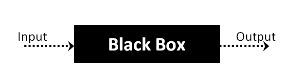
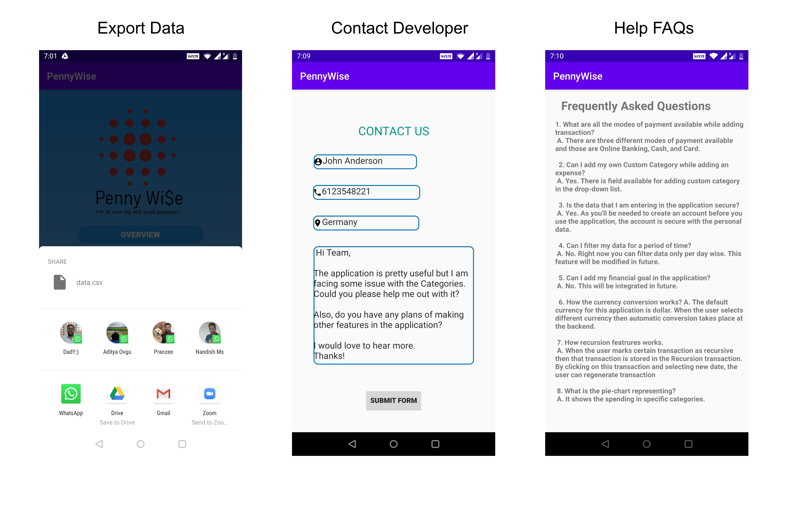

# PennyWise

# Team code_squad

### ISEE 2020 Beta Prototype 

### Overview

We have reached very close to the end of our application development. All the user stories were implemented into working prototypes. Hence, we have reached phase in the cycle where our application needs rigorous testing so as to provide a seamless and unparalleled experience to our customers. We have used various testing methods are all these are explained in great detail in this blog.

### General Test Process

As far as our testing is concerned, we have followed Condition Coverage Technique and Branch Coverage Technique for the White Box testing and for Black Box testing, we have followed the equivalence partitioning technique:

### Testing Process

Major testing techniques which are available at our disposal are the following:

- **Unit Testing** - Testing is carried out by the developer after the completion of a module or functionality.
- **System Testing** - Testing is carried out by a test analyst only for the module or functionality
- **System Integration Testing**- Testing is carried out by a test analyst after all the modules are integrated.
- **Acceptance Testing** - Testing is carried out by a user for the entire functionality of the application or module.

White box comprises of Unit testing and other techniques such as System Testing and Acceptance Testing, Integration Testing are classified under Black Box Testing.

### White Box Testing

This method of testing is from the developers' point of view. It enables the developer to check the flow of control of the line of codes through various loops and code structures. For the developers to use this method, they can follow the below two simple steps:

- First to get the complete working knowledge of the written code.
- To select the most suitable coverage technique, that is applicable to the written code.

### White Box Testing Techniques

There exist many coverage techniques for the developers to scrutinize blocks of written codes. They are:

- **Statement Coverage** - Tests each statement at least once. The main idea is to cover all executable statements inside the given block of code and check them with test cases.
- **Function coverage** -Tests each function at least once.
- **Edge coverage** -Tests every edge in the control flow graph in the program at least once
- **Branch coverage** -Tests every control statement in the program at least once.
- **Condition coverage** - Tests every boolean sub-expression whether evaluated to both true and false.

The following classes were tested using White Box Testing:

#### Field Validation while saving transactions:

##### Category Class Validation

##### All mandatory transaction fields validation

#### Field Validation while authenticating user:

##### Registration of new user validation

##### Login validation

##### Save Transactions

##### Delete Transactions from DB

##### Export data

##### Contact Developers via Email

##### Summary of classes covered under White-Box Testing

### Black Box Testing 

Black Box Testing is a testing technique in which the functionality of the application is tested without knowing the internal code or the underlying structure. The tests can be functional or non-functional.

### Types of Black Box Testing

- **Functional Testing:** Usually performed by Test Analysts to check the functionality of the application based on the requirements received

- **Non-Functional Testing:**This testing focuses on the performance, usability, and scalability of the application

- **Regression Testing:** Testing done immediately after making any changes to the source code whether to know if all the earlier working functionalities are in place and has no impact on any of the functionalities done earlier

  

### Black Box Testing Types

- **Equivalence Partitioning:** It is a test design technique that involves dividing input valid and invalid partitions and selecting particular values from each partition as test data.

- **Boundary Value Analysis:** It is a test design technique that involves the determination of boundaries for input values and selecting values that are at the boundaries and just inside/outside of the boundaries as test data.

- **Cause-Effect Graphing:** It is a test design technique that involves identifying the case and effects producing a Cause-Effect Graph.

  

### Test Scenarios

### Test Cases

### Status and Defect

### Summary of Changes

##### Application Screenshots of Beta Prototype

​

| New Features               | Description                                                  |
| :------------------------- | :----------------------------------------------------------- |
| **Export Data**            | The transactions data created by the user can be exported to csv format for user to open the file as a sheet. |
| **Contact Developer Form** | User will be able to contact developers regarding any issue / feedback to be given. User will be required to provide information with some details such as user's contact number, location, name and message. After submitting the form, his mailing application will be opened with automatic filled in fields and user has to send this email. |
| **Help FAQs**              | For the ease of understanding the application especially to new users, user can go to Help and view some put in FAQs. |
| **Delete Transactions**    | User can get rid of expenses / transactions that were created by user, if user no longer needs them |
| **View Summary and Graph** | User can view a graphical layout like pie chart for better understanding his expenses. |
| **Push Notifications**     | User can now get push notifications when his expenses get exceeded by income. |
| **Cosmetic Changes**       | The application is now redefined for user to have a simple and friendly user experience. Alignment updates, icons, graphs have been added to give application an insightful power. |

### Download our application here by clicking on this link
[PennyWise.apk](uploads/76b6ca23c81fcf7cfef6258c67154119/PennyWise.apk)

### References

**Fig 13:** [https://www.guru99.com/black-box-testing.html](https://www.guru99.com/black-box-testing.html)

### *Thank you for visiting our blog!*

