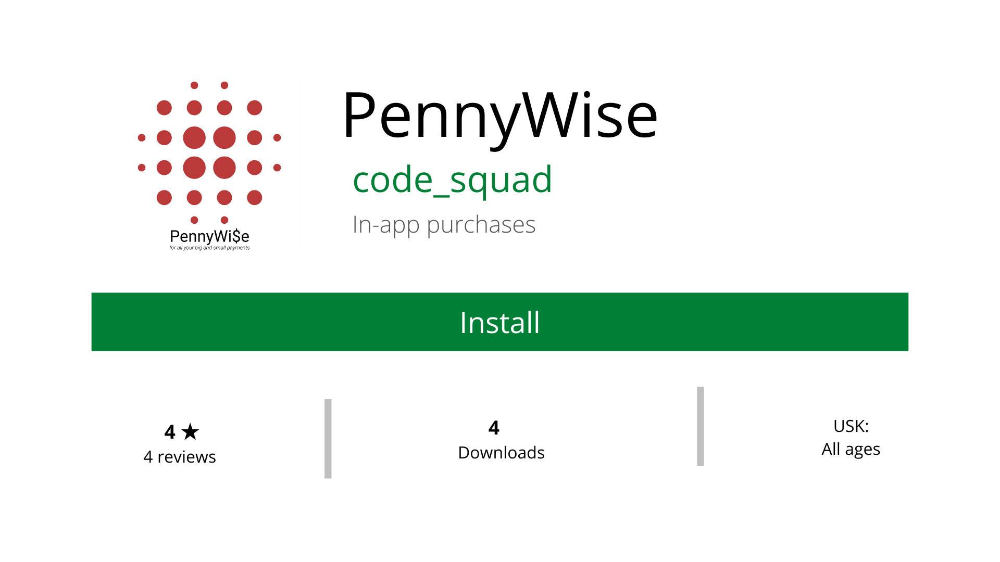
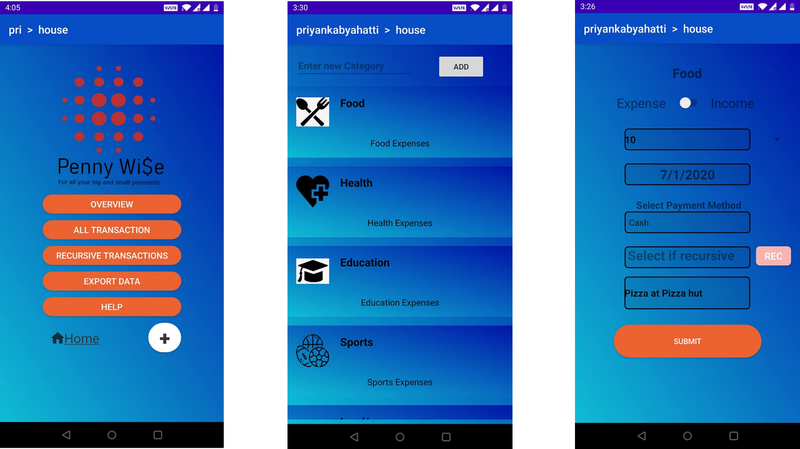
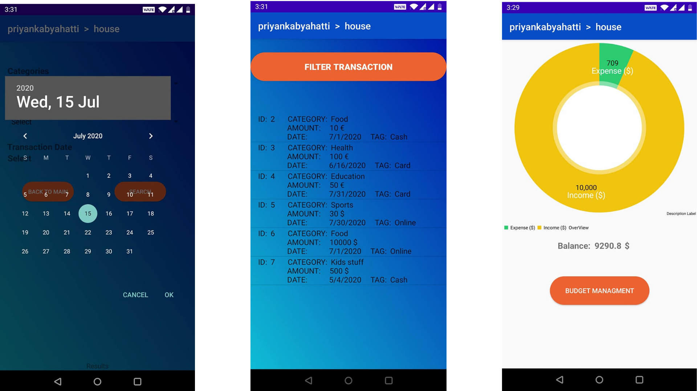
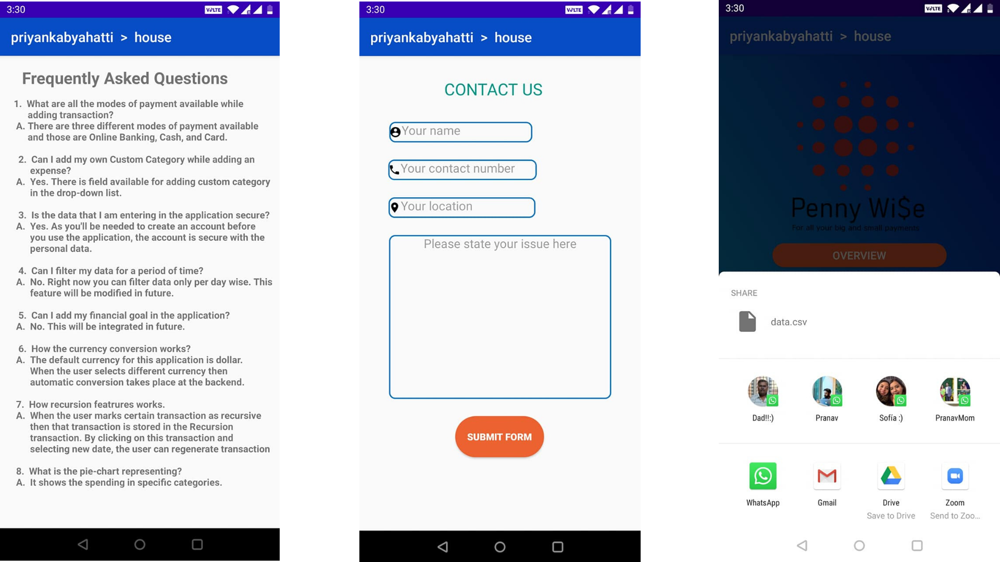

													 

**Watch a short video on our app here**

### About this app

Control and manage your money. Figure out how to track your expenses and achieve your financial goals!

**It is pretty simple!**

PennyWise is a money-tracking application we have developed, that helps an individual to monitor one’s day to day expenses. The Interface is built in a simple and clean way to assure ease of usage for you. It allows you to use all the features that are essential to plan and manage your expenses. Tracking of income / expense is possible through our visualization panel in the form of pie charts. 

Below are some of the highlighted functionalities:

**Features:**

- **Manage accounts**

  You can create your own account with password secured. All your details and data are secured with the account and not visible to anyone else.

- **Manage categories**

  When creating a transaction, you can pick a category relevant to the expense from a bunch of options given. If the category of the expense is not present, you also have an option to create one custom category and use that to add a transaction.

- **Manage expenses or income**

  You can add an expense, or you can add income details. Both options are present. While you add one of these, you have several mandatory fields such as:

  * date of expense / income
  * amount
  * recursive drop down 
  * payment mode
  * currency choice
  * optional comment box to make notes related to expense / income.

- **Manage recurring transactions**

  If you have any recurring transactions and you want to mark them as recurring, there is an option for you to do that and track it separately.

- **Visualizations of your data**

  To aid you in giving a graphical view of your activities that is income / expense details, pie charts are built for you to get the sense of overall summary of your accounts.

- **Different types of currencies**

  You will get a list of different currencies to pick from while you add transactions.

- **Export your expenses** 

  You can export your expenses to Google drive and gmail as a csv sheet to analyze it in different format.

- **Push notifications**

  If you exceed your expenses more than your income, you will get notified on that.

- **Budget Management**

  An option to set a budget limit on all categories.

 

  

### How to use our app?

* **Signup / Login**

  If you are a new user, please register on our application with username and password and proceed to login. If your account, already exists then proceed with login.

* **Creating new transaction**

  Add a new expense by using the toggle button and entering all mandatory fields such as amount, currency choice, date of transaction, payment mode, recurring transaction or not, and add notes if any.

* **View expense history**

  Click on "All Transactions" button on the homepage to view all the added expenses. Click on "Recursive Transactions" to view all recurring expenses.

* **Filter Transactions**

  Use filter option and you can filter by dates, payment modes or categories to view only those transactions that fulfil selected criteria.

* **Delete Transaction**

  Click on "All Transactions" button. Select any expense you want to delete and proceed to delete.

* **Overall Summary**

  Click on Overview button to get over all summary of your activities.

* **Budget Management**

  Click on budget management button inside overview page, to set budget limits to all categories.

* **Help Menu**

  Click on help button to get 3 options:

  * FAQs: View most frequently asked questions
  * Contact: Contact developers incase of any questions or feedback or issues.
  * Info about app: Get some help in navigating through our application and exploring different features.

**What's new**

* Contact developers page
* Export your data option
* Pie chart graphics to view overall summary of data

**Download the application apk file here**

[PennyWise.apk](uploads/82a73af138e8239cc2fdf95e103085cb/PennyWise.apk)

**More info**

Contains no ads

No ads are placed by the app developer

**App info**

|                   |                 |
| ----------------- | --------------- |
| Version           | 1.0             |
| Updated on        | 29-June-2020    |
| Downloads         | 4               |
| Download size     | 6.24 MB         |
| In-app purchases  | Free            |
| Offered By        | OVGU Magdeburg  |
| Released on       | 15th-July-2020  |
| Category          | Finance         |
| Supported Devices | Android devices |
| Availability      | PlayStore       |

### Developer contact

 
code.squad.2020@gmail.com

Universitätspl. 2, 39106 Magdeburg, Germany

# *Thank you for visiting our blog!*

